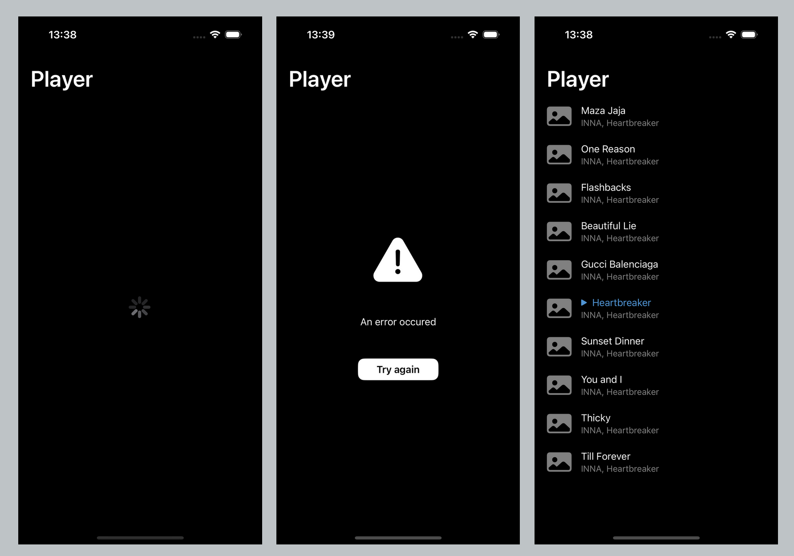

#  Player

A demonstrative music application inspired by apps like Spotify or Apple Music. The app uses locally stored music data, reads it and plays the audio via AVAudioPlayer. UI made in SwiftUI with the use of Combine Publishers. Tests are done with Swift Testing. Constructed on MVVM architecture. The app uses CocoaPods for dependency management and some perl scripts for sorting. Available on iOS 16.6 up. Features listed below:

### 1. Track list

A list of tracks displayed to the user that allows tracks to be played directly. Includes state changes as visible below: loading, failure and success changes. The list is refreshable thus at any time it's possible to refresh the list. Plays audio without background mode or playback.

